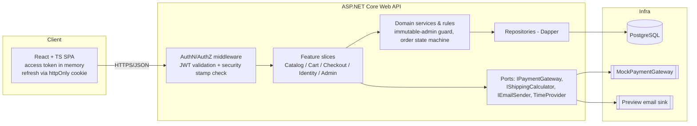
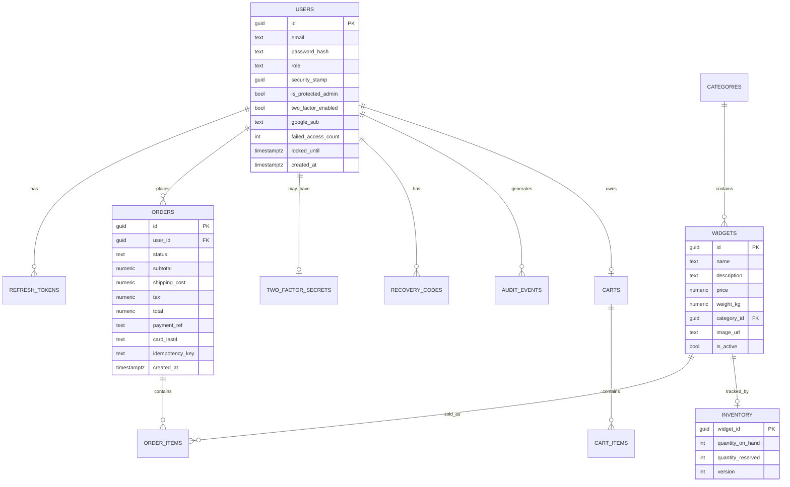

# WidgetWorks — Architecture & Technical Design

**Companion to:** `01-Product-Requirements-Document.md`
**Document type:** Architecture proposal & technical design (ADR‑flavored)
**Prepared by:** Product Owner / acting Solution Architect
**Date:** August 7, 2026
**Status:** Draft v0.1 — for review

---

## 1. Design goals (what the architecture must earn)

1. **Production‑shaped, not enterprise‑bloated.** Clean seams a senior reviewer recognizes, without ceremony that a small store doesn't need.
2. **Dapper, no EF Core; no MediatR.** Explicit SQL, explicit dependencies, explicit wiring — see §4 for how we stay clean without MediatR.
3. **Security is structural.** Token rotation, 2FA, and the immutable admin are enforced in the domain/data layers, not the UI.
4. **Time is injected everywhere** via `TimeProvider`, so security timing is testable.
5. **Everything demoable in one command.**

---

## 2. Recommended stack — ✅ APPROVED (Aug 7, 2026)

| Concern | Recommendation | Why | Alt. considered |
|---|---|---|---|
| Runtime | **.NET 10 (LTS), C# 14** | Current LTS (shipped Nov 2025) | .NET 8 LTS (also fine; `TimeProvider` since 8) |
| API | **ASP.NET Core Minimal APIs** | Clean, fast, first‑class OpenAPI | MVC controllers |
| Data access | **Dapper** over ADO.NET | Explicit SQL, "close to production," fast | EF Core (excluded per your direction) |
| Database | **PostgreSQL 16** in Docker | Strong concurrency primitives for stock/idempotency | ✅ Confirmed over SQLite & SQL Server |
| Migrations | **DbUp** | Plain‑SQL, versioned migrations without EF | FluentMigrator |
| Front end | **React + TypeScript (Vite)** | Most production‑common for a JWT SPA | ✅ Confirmed over Blazor / Razor Pages |
| AuthN tokens | **JWT** access + opaque **refresh** tokens | Enables rotation & key rotation | Cookie/session |
| 2FA | **TOTP** via `Otp.NET` (+ QR) | Authenticator‑app standard; offline | Email/SMS OTP |
| Social login | **Google OIDC** (`Microsoft.AspNetCore.Authentication.Google`) | Funnels into our own JWT session | Microsoft/GitHub |
| Password hashing | **ASP.NET Core `PasswordHasher<T>`** or **BCrypt.Net** | Salted, adaptive | Argon2 |
| Validation | **FluentValidation** | Testable, no MediatR pipeline | DataAnnotations |
| Logging | **Serilog** (structured) | Great DX, sinks | Built‑in `ILogger` |
| Testing | **xUnit** + **`FakeTimeProvider`** + **Testcontainers** | Deterministic time; real DB in integration tests | In‑memory fakes |
| Docs | **OpenAPI/Swagger UI** | Explorable API | — |
| Orchestration | **Docker Compose** (api + db + web) | One‑command run | .NET Aspire |

**One‑line proposal:** *React+TS SPA → ASP.NET Core Minimal API (JWT) → Dapper → PostgreSQL, no MediatR/EF, time via `TimeProvider`, all in Docker Compose.*

---

## 3. High‑level architecture



**Layering (inside the API):**

- **Endpoints** (Minimal API handlers) — HTTP concerns only: bind, validate, map result → status code.
- **Feature/application services** — orchestrate a use case (e.g., `PlaceOrderHandler`). Plain classes, injected directly. *No mediator.*
- **Domain** — entities + invariants (order state machine, immutable‑admin guard, stock rules).
- **Ports (interfaces)** — `IPaymentGateway`, `IShippingCalculator`, `IEmailSender`, `ITokenService`, `TimeProvider`, repositories.
- **Adapters/Infrastructure** — Dapper repositories, mock payment, preview email, JWT token service.

---

## 4. How we stay clean **without** MediatR

MediatR's value is decoupling a request from its handler via an in‑process bus. We get the same separation with **plain handler classes registered in DI** — no bus, no reflection, easier to read stack traces.

**Solution layout — Onion / Clean Architecture, matching your `ToDoApp` conventions** (four projects; feature folders inside `Application`; no MediatR):

```
WidgetWorks.sln
src/
  WidgetWorks.Domain/          # entities, value objects, invariants, state machines (no deps)
  WidgetWorks.Application/     # use cases as plain handlers + port interfaces (depends on Domain)
    Auth/                      #   Register/ Login/ Refresh/ Logout/ ResetPassword/ Google/
    TwoFactor/                 #   Enroll/ Challenge/ Disable/ Recovery/
    Security/                  #   SecureMyAccount/  (rotates security stamp -> global invalidation)
    Catalog/                   #   BrowseWidgets/ GetWidget/ Search/
    Cart/                      #   AddItem/ UpdateItem/ RemoveItem/ GetCart/
    Checkout/                  #   PlaceOrder/ (handler + validator)
    Admin/                     #   Widgets/ Inventory/ Orders/
    Common/                    #   Result<T>, error types, abstractions
    DependencyInjection.cs
  WidgetWorks.Infrastructure/  # Dapper repos, JWT service, payment adapters, email sink, DbUp migrations
  WidgetWorks.WebApi/          # Minimal API endpoints, middleware/filters, composition root
tests/
  WidgetWorks.UnitTests/
  WidgetWorks.IntegrationTests/
docs/                          # PRD + architecture doc live here (mirrors ToDoApp/docs)
```

Same onion layering as `ToDoApp` (`Domain → Application → Infrastructure → WebApi`, dependencies point inward). The one deliberate difference from a MediatR codebase: each feature folder holds a **plain handler class** the endpoint calls directly, instead of a request routed through a bus.

**A slice, end to end (sketch):**

```csharp
// Endpoint: HTTP only
app.MapPost("/api/checkout", async (PlaceOrderRequest req, PlaceOrderHandler handler, CancellationToken ct) =>
{
    var result = await handler.Handle(req, ct);
    return result.IsSuccess ? Results.Ok(result.Value) : result.ToProblem();
}).RequireAuthorization();

// Handler: the use case. Plain class, constructor-injected deps. No MediatR.
public sealed class PlaceOrderHandler(
    ICartRepository carts,
    IOrderRepository orders,
    IShippingCalculator shipping,
    IPaymentGateway payments,
    TimeProvider clock,
    IUnitOfWork uow)
{
    public async Task<Result<OrderConfirmation>> Handle(PlaceOrderRequest req, CancellationToken ct)
    {
        // 1) load cart, 2) calc shipping, 3) reserve stock (atomic),
        // 4) charge via gateway (idempotent), 5) persist order, 6) clear cart.
        // All timestamps from `clock.GetUtcNow()`.
    }
}
```

Registration is explicit (`services.AddScoped<PlaceOrderHandler>()`), or a tiny convention scan — either way, no bus.

**Cross‑cutting concerns** that MediatR pipelines would handle become ordinary ASP.NET Core **middleware / filters**: validation (FluentValidation endpoint filter), exception→ProblemDetails mapping, request logging, and auth.

**Error handling:** a lightweight **`Result<T>`** type instead of throwing for expected failures (declined payment, out of stock, invalid transition). Maps cleanly to HTTP `ProblemDetails`.

---

## 5. Data model (initial)



Notes:
- `security_stamp` is the linchpin of §6.3 (global invalidation).
- `refresh_tokens` stores a **hash** of the token, plus `family_id`/`replaced_by` for **rotation + reuse detection**.
- `inventory` splits `quantity_on_hand` and `quantity_reserved`; `available = on_hand − reserved`. `version` (or `SELECT ... FOR UPDATE`) enforces no‑oversell concurrency (§8).
- `orders.idempotency_key` is unique → duplicate checkout submits collapse to one order (§8).
- `users.google_sub` links a Google identity to the local account (nullable, unique).
- Card data: **only** `card_last4` and a mock `payment_ref`. Never the PAN.

---

## 6. Authentication & the security model (the headline)

### 6.1 Token shape

- **Access token — JWT**, short‑lived (~10–15 min). Claims: `sub`, `role`, and a **`stamp`** claim = a snapshot of the user's `security_stamp`. Header carries a **`kid`** (key id).
- **Refresh token — opaque random** (not a JWT), long‑lived. Stored **hashed** server‑side, delivered to the SPA as an **httpOnly, Secure, SameSite** cookie so JS can't read it (mitigates XSS token theft).

### 6.2 Refresh rotation + reuse detection

Every refresh **rotates** the token: the old one is revoked and a new one issued in the same `family_id`. If a **revoked** refresh token is ever presented again (classic stolen‑token replay), we revoke the whole family — the thief and the victim both get logged out, which is the safe outcome.

### 6.3 "Secure my account" — global, instant invalidation (two‑level rotation)

This is the "**should any account be compromised, rotate the token**" requirement. Two independent rotation levers:

**(a) Per‑user security stamp — the fast, targeted lever.**
Each access JWT carries the user's `security_stamp` as a claim. On **every** request, auth middleware compares the token's `stamp` claim to the current `security_stamp` in the DB (cached briefly). "Secure my account," password reset, and 2FA changes **rotate the stamp** → every previously issued access token instantly fails validation, and all that user's refresh tokens are revoked. No waiting for expiry.

**(b) Global signing‑key rotation — the platform lever.**
Signing keys live in a small key‑ring keyed by `kid`. Newly issued tokens use the **current** key; tokens signed by a **still‑trusted previous** key keep validating until they expire (rolling rotation, no mass logout). A **compromised key** is moved to a revoked set → every token with that `kid` is rejected immediately.

Together: (a) handles "this user was compromised," (b) handles "our signing key leaked."

### 6.4 Two‑factor (TOTP)

**How TOTP works (RFC 6238):** at enrollment the server generates a random **shared secret** and gives it to the user's authenticator app once (via QR). Both sides derive the same 6‑digit code by taking `counter = floor(unixTime / 30s)`, computing `HMAC‑SHA1(secret, counter)`, and truncating to 6 digits — so the code rotates every 30 seconds. Library: **Otp.NET**.

- **Enrollment:** issues a secret + QR; the user must confirm one working code before 2FA turns on (a mis‑scan can't lock them out). Recovery codes are shown once, stored hashed, single‑use.
- **Login challenge:** a valid password yields a limited‑scope **challenge token** (authorizes only the 2FA step, never catalog/checkout); submitting a valid TOTP code within the ±1‑step drift window yields full access + refresh tokens.
- **Recovery fallback:** a valid, unused recovery code authenticates and is consumed.
- **`TimeProvider` integration:** Otp.NET's `VerifyTotp` takes an explicit timestamp, so we pass `clock.GetUtcNow().UtcDateTime` — making 2FA deterministically testable.
- Failed 2FA/recovery attempts feed the **lockout** counter. Secrets and recovery codes are never logged.

### 6.5 Immutable administrator

Enforced in **three** places (defense in depth), not just hidden buttons:

1. **Seeding:** on first migration, insert one admin with `is_protected_admin = true` and documented demo credentials.
2. **Domain/service guard:** any update/delete/role‑change/disable path checks `if (user.IsProtectedAdmin) return Result.Fail(...)` — rejecting the change **even if requested by that admin**.
3. **Data layer:** repository write methods refuse to mutate or delete the protected row (and/or a DB rule/trigger as a backstop).

A dedicated test *attempts* each mutation and asserts rejection. The protected admin is also **exempt from lockout/removal**, so the demo can always log in.

### 6.6 External identity — "Sign in with Google" (OIDC)

Google login is an *additional* front door, not a replacement: local email/password and Google both funnel into the **same** account and the **same** token model, so JWT rotation, the security stamp, and "secure my account" behave identically no matter how a user signed in.

- **Authorization‑code flow with PKCE** (OIDC). The API validates Google's ID‑token signature against Google's published JWKS and checks `iss`/`aud`/`exp` before trusting it.
- **Account linking:** a first Google login for a known email links to the existing local account (configurable); a new email creates a `Customer`. Stored via `users.google_sub`.
- After validating Google we mint **our own** access + refresh tokens — Google is only the authentication step.
- **2FA interplay:** Google users get their second factor from Google; our TOTP 2FA covers local‑password accounts.
- **The immutable admin stays local‑password only** — never dependent on Google — so the demo always works offline.
- Config: Google client ID/secret + redirect URI live in configuration/user‑secrets, **never committed**.

---

## 7. Time abstraction — `TimeProvider`

- Register the framework clock once: `services.AddSingleton(TimeProvider.System);`
- **Inject `TimeProvider`** into anything time‑dependent: token issuance/expiry, refresh rotation windows, TOTP validation, lockout windows, order timestamps.
- **Ban `DateTime.Now` / `DateTime.UtcNow`** in application code (review rule; optionally a banned‑symbols analyzer). Always `clock.GetUtcNow()`.
- In tests, use **`FakeTimeProvider`**: set an instant, advance it, and assert token expiry boundaries, lockout release, and TOTP step validity. This is the concrete payoff of the abstraction.

---

## 8. Checkout: concurrency, atomicity & idempotency

The trickiest correctness area; three guarantees:

1. **No overselling.** Stock decrement happens inside a DB transaction using optimistic concurrency (`inventory.version`) or pessimistic `SELECT ... FOR UPDATE`. If requested quantity exceeds available at commit time, the transaction fails and no order is created.
2. **Atomic order creation.** Reserve stock → create order → clear cart in **one** transaction (`IUnitOfWork` wrapping a Dapper `IDbTransaction`). Only an **approved** payment commits.
3. **Idempotency.** The client sends an `Idempotency-Key` header (a GUID per checkout attempt), stored on the order with a unique constraint; a duplicate submit returns the **original** order instead of charging/creating twice.

---

## 9. Payment — mock behind a production‑shaped port

Ports & Adapters, so a real gateway drops in later with zero changes to the use case.

```csharp
public interface IPaymentGateway
{
    Task<PaymentResult> AuthorizeAsync(PaymentRequest request, CancellationToken ct);
}
```

**`MockPaymentGateway`** returns **deterministic** results driven by the test card number (documented in the README), e.g. `4242 4242 4242 4242` → approved, `4000 0000 0000 0002` → declined, `4000 0000 0000 9995` → insufficient funds. It validates Luhn + expiry (via `TimeProvider`), never stores the PAN, and returns a mock `payment_ref` and `last4`.

✅ **Q6 RESOLVED — both (Aug 7, 2026):** ship the pure `MockPaymentGateway` as the **default** (zero‑setup, deterministic demo) **and** a `StripePaymentGateway` implementing the *same* `IPaymentGateway` against **Stripe test mode**, selectable by configuration. The `PlaceOrderHandler` use case is byte‑for‑byte unchanged; only the registered adapter differs. Stripe test mode uses published test cards + test keys (nothing real is charged) and adds `PaymentIntent` + **webhook** handling. The README documents the small extra setup (test API keys + webhook signing secret).

---

## 10. Shipping — pluggable strategy

```csharp
public interface IShippingCalculator
{
    ShippingQuote Quote(Cart cart, Address destination, ShippingMethod method);
}
```

Recommended default: a **composite** of small strategies so the calculation is visibly real: **weight‑based** (sum of `weight_kg × quantity` → tiered price), **zone‑based** (destination region → multiplier/fee), **method** (Standard/Express changes rate and estimated delivery window from `clock.GetUtcNow()`), and a **free‑shipping threshold**. Strategies are registered and selected by config.

---

## 11. Migrations without EF

- **DbUp** runs ordered, embedded **`.sql`** scripts on startup, tracking applied scripts in a journal table. Plain SQL keeps us "close to production" and reviewable.
- Seed data ships as idempotent scripts including **two demo accounts** documented in the README: (1) an **immutable admin** (`admin@widgetworks.demo`) managing widgets/inventory/orders, and (2) a **demo customer** (`demo@widgetworks.demo`). Plus categories and sample **widgets**, each with a name, description, product image, price, weight, and opening quantity on hand (`quantity_reserved = 0`).
- Alternative: **FluentMigrator** for C#‑authored migrations with up/down.

---

## 12. Testing strategy

| Layer | Tooling | What we prove |
|---|---|---|
| **Unit** | xUnit + `FakeTimeProvider` | Token expiry/rotation edges, TOTP window, lockout release, order state machine, shipping math, immutable‑admin guard |
| **Integration** | xUnit + **Testcontainers (PostgreSQL)** | Real Dapper SQL: refresh rotation + reuse detection, atomic stock decrement / no oversell, idempotent checkout |
| **API/contract** | `WebApplicationFactory` | End‑to‑end auth flow: register → login → 2FA → refresh → secure‑my‑account invalidation |
| **Concurrency** | parallel integration test | Two buyers, one unit left → exactly one succeeds |

---

## 13. Cross‑cutting concerns

- **Validation:** FluentValidation as a Minimal‑API endpoint filter → `400` problem document.
- **Error mapping:** central handler → RFC 7807 `ProblemDetails`; expected failures flow through `Result<T>`.
- **Logging:** Serilog structured logs; **never** log secrets, tokens, PANs, TOTP secrets, or recovery codes.
- **Rate limiting:** ASP.NET Core rate limiter on `/auth/*`.
- **CORS:** locked to the SPA origin.
- **Secrets/config:** `appsettings` + env vars + user‑secrets in dev; nothing sensitive committed.
- **Audit:** security events → `audit_events` with actor, action, `TimeProvider` timestamp, source metadata.

---

## 14. Deployment & "run in one command"

**Docker Compose** with three services: `db` (postgres:16 with healthcheck + volume), `api` (.NET; runs DbUp migrations+seed on startup, waits for db healthy), `web` (the SPA). The README documents the demo admin credentials, test card numbers, and a short "exercise the security features" script. **Q9 (open):** optional cloud deploy for a live URL vs. clone‑and‑run only.

---

## 15. Architecture Decision Records (summary)

> **Tech stack approved by Burt on Aug 7, 2026** — statuses below are Accepted. Remaining open items are *scope* decisions (Q1, Q3–Q5, Q8, Q9), not stack.

| ADR | Decision | Status | Rationale (short) |
|---|---|---|---|
| ADR‑001 | Target **.NET 10 LTS** | ✅ Accepted | Current LTS; `TimeProvider` available |
| ADR‑002 | **Dapper**, not EF Core | ✅ Accepted | Explicit SQL, production‑close |
| ADR‑003 | **No MediatR**; plain handlers | ✅ Accepted | Same decoupling, less magic |
| ADR‑004 | **JWT access + rotating opaque refresh** | ✅ Accepted | Meets rotation/compromise brief |
| ADR‑005 | **Security stamp** for global invalidation | ✅ Accepted | Instant compromise response |
| ADR‑006 | **`kid`‑based signing‑key rotation** | ✅ Accepted | Retire leaked keys w/o mass logout |
| ADR‑007 | **TOTP** 2FA + recovery codes (Otp.NET) | ✅ Accepted | Offline, standard, no sender |
| ADR‑008 | **Immutable admin** enforced in domain+data | ✅ Accepted | Demo never breaks |
| ADR‑009 | **`TimeProvider`** everywhere | ✅ Accepted | Deterministic security tests |
| ADR‑010 | **Mock payment** + **Stripe test mode** behind `IPaymentGateway` | ✅ Accepted | Zero‑setup demo default; Stripe adapter proves the seam |
| ADR‑011 | **PostgreSQL 16** | ✅ Accepted | Free, prod‑common, concurrency |
| ADR‑012 | **React + TS SPA** | ✅ Accepted | Best JWT demo |
| ADR‑013 | **DbUp** SQL migrations | ✅ Accepted | No‑EF, versioned, reviewable |
| ADR‑014 | **Idempotency‑Key + atomic stock** on checkout | ✅ Accepted | No double charge / oversell |
| ADR‑015 | **Google sign‑in (OIDC)** → our own JWTs | ✅ Accepted | Social login without ceding our session model |
| ADR‑016 | **Onion/Clean Architecture**, matching `ToDoApp` | ✅ Accepted | Consistency with your existing repo |
| ADR‑017 | **Inventory split** on_hand + reserved → available | ✅ Accepted | Reserve‑at‑checkout prevents oversell |

---

## 16. Decision log & what's left

**✅ Resolved:** Q2 Front end → React + TypeScript SPA; Q7 Database → PostgreSQL 16; Q6 Payment → Mock + Stripe test mode; full stack per §2 and ADRs 001–017.

**⏳ Still open (scope/product, not stack):**
1. **Q1 Roles** — add an editable "Manager" role, or just Customer + immutable super‑admin?
2. **Q3 Tax** — omit, a configurable flat rate, or a small zone table?
3. **Q5 Guest checkout** — allow buying without an account, or require registration?
4. **Q4 Coupons / promotions** — include as a stretch goal or leave out?
5. **Q8 Email** — preview inbox (mail catcher) vs. just logging rendered emails?
6. **Q9 Cloud deploy** — live hosted demo URL, or clone‑and‑run only?

*End of architecture proposal.*
