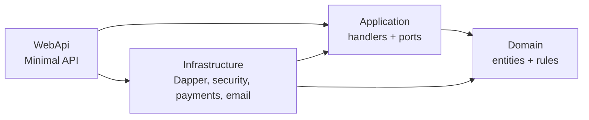

[← Handbook index](README.md) · [Project README](../../README.md)

# 2. Architecture

## Onion / Clean layering

Dependencies point **inward** only. The Domain knows nothing about the outside world;
the outside world depends on abstractions the inner layers define.

- **Domain** — entities (`User`, `Widget`, `Cart`, `Order`, …), the `Result`/`Result<T>`
  type, and rules like `ProtectedAdminGuard`. No framework dependencies.
- **Application** — one class per use case (no MediatR), plus **ports** (interfaces) it
  needs: `IUserRepository`, `IPaymentGateway`, `ITaxCalculator`, `IEmailSender`, etc.
- **Infrastructure** — adapters that implement the ports: Dapper repositories, the JWT/
  TOTP/BCrypt security services, payment gateways, email senders, DbUp migrations, seeder.
- **WebApi** — thin Minimal-API endpoints that bind requests, call a handler, and map
  `Result` to HTTP; plus DI and authentication/authorization wiring.

Why this shape: business logic is isolated and unit-testable without a database or web
host, and infrastructure choices (DB, payment provider, email) are swappable behind ports.

## Key conventions

- **No MediatR** — handlers are plain classes registered in DI and invoked directly.
- **Dapper, not EF Core** — explicit SQL, `snake_case` ↔ PascalCase mapping, and
  transactions passed via `CommandDefinition`. No ORM magic.
- **`Result` type** — expected failures are returned, not thrown; endpoints map failures
  to 400/401/404.
- **`TimeProvider`** — injected everywhere; tests use `FakeTimeProvider` to make
  lockouts, token expiry, and TOTP deterministic.

## Request lifecycle (example: place order)

1. `POST /checkout` → endpoint binds the request and calls `CheckoutHandler`.
2. The handler **re-prices server-side** (never trusts client totals): loads the cart,
   computes shipping + per-state tax, and builds the order.
3. `IOrderRepository.TryPlaceAsync` inserts the order and **reserves inventory atomically**
   (a Dapper transaction; conditional stock UPDATE, rolls back if short).
4. `IPaymentGateway.ChargeAsync` charges (Mock or Stripe).
5. On success → mark Paid, clear cart, send the receipt email (best-effort). On decline →
   release the reservation and mark PaymentFailed. On an async (BNPL/redirect) authorization →
   park in **AwaitingPayment** until a provider webhook settles it (see [Payments](05-payments.md)).

## Security model

- **Access tokens** — short-lived JWTs carrying `sub`, `role`, and a per-user `stamp`
  claim, signed with a key identified by a `kid` header.
- **Refresh tokens** — opaque, SHA-256 **hashed at rest**, single-use with **rotation +
  reuse detection** (a reused token revokes the whole family).
- **Security stamp** — every token validation checks the token’s `stamp` against the
  user’s current stamp. Rotating the stamp (password reset, “secure my account,” enabling
  2FA) **instantly invalidates all existing access tokens** for that user.
- **`kid` key rotation** — a signing-key ring signs with the active key and still validates
  tokens signed by previous, non-revoked keys; unknown/revoked `kid` → rejected.
- **2FA** — TOTP (authenticator app) with single-use, hashed recovery codes.
- **The order owns its fulfilment rules.** `OrderStatus.AllowedNext`/`CanTransition` hold the
  transition table and `Order.TransitionTo` applies it, so the invariant travels with the
  entity instead of living in whichever handler happens to call it. `UpdateOrderStatusHandler`
  asks permission first and reports a refusal as a `Result` — a rejected transition is an
  expected outcome at an API boundary, not an exception.
- **One pricer, two callers.** `OrderPricer` is the single calculation behind both
  `POST /checkout/quote` and checkout itself, so the total a shopper is shown and the total
  they are charged cannot drift apart. `OrderDraft` builds the order row, leaving
  `CheckoutHandler` sequencing steps rather than performing them.
- **RBAC** — policy-based: `ManageCatalog` (Manager or Administrator) guards catalog/orders;
  `ManageUsers` and `DeleteCatalog` are Administrator-only. Removing a widget is deliberately
  narrower than editing one: a Manager can create, edit, restock and hide, but not retire.
- **Retiring a widget** — `DELETE /admin/catalog/widgets/{id}` deletes outright only when the
  widget has no order history. Once it appears on an order it is **archived** instead
  (`archived_at` set, `is_active` cleared): `order_items` still references the row, so past
  orders stay reportable, while every listing, the product page and add-to-cart drop it. The
  response says which of the two happened.
- **Immutable admin** — the seeded administrator’s identity can’t change or be deleted,
  enforced at the **domain** layer (`ProtectedAdminGuard`) **and** the **database** layer
  (a trigger) — defense in depth.

## Ports & adapters (swappable seams)

| Port (Application) | Default adapter (Infrastructure) | Swap for… |
|---|---|---|
| `IPaymentGateway` (+ `IPaymentWebhookParser`) | `MockPaymentGateway` | `StripePaymentGateway` (test) / real PSP |
| `ITaxCalculator` + `ITaxRateProvider` | state-level rate table | Avalara / TaxJar / Stripe Tax |
| `IShippingCalculator` | tiered flat-rate | carrier-rate API |
| `IEmailSender` | Dev (stdout) | SMTP (SendGrid/Mailgun/SES/Mailpit) |
| `IGoogleTokenValidator` | Google JWKS validation | — |

Each swap is a DI/config change with **no impact on checkout or handlers**.
