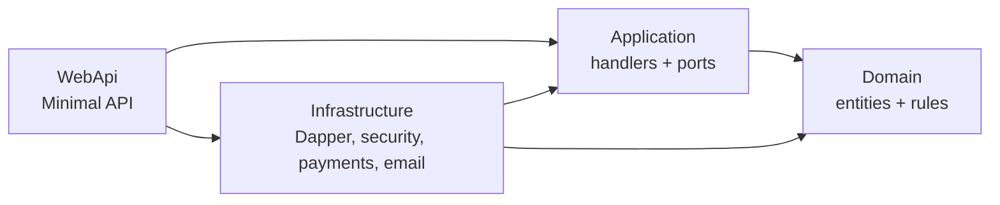

[← Handbook index](README.md) · [Project README](../../README.md)

# 2. Architecture

## Onion / Clean layering

Dependencies point **inward** only. The Domain knows nothing about the outside world;
the outside world depends on abstractions the inner layers define.

```mermaid
flowchart LR
  Web[WebApi\nMinimal API] --> App[Application\nhandlers + ports]
  Infra[Infrastructure\nDapper, security, payments, email] --> App
  App --> Dom[Domain\nentities + rules]
  Infra --> Dom
  Web --> Infra
```

- **Domain** — entities (`User`, `Widget`, `Cart`, `Order`, …), the `Result`/`Result<T>`
  type, and rules like `ProtectedAdminGuard`. No framework dependencies.
- **Application** — one class per use case (no MediatR), plus **ports** (interfaces) it
  needs: `IUserRepository`, `IPaymentGateway`, `ITaxCalculator`, `IEmailSender`, etc.
- **Infrastructure** — adapters that implement the ports: Dapper repositories, the JWT/
  TOTP/BCrypt security services, payment gateways, email senders, DbUp migrations, seeder.
- **WebApi** — thin Minimal-API endpoints that bind requests, call a handler, and map
  `Result` to HTTP; plus DI and authentication/authorization wiring.

Why this shape: business logic is isolated and unit-testable without a database or web
host, and infrastructure choices (DB, payment provider, email) are swappable behind ports.

## Key conventions

- **No MediatR** — handlers are plain classes registered in DI and invoked directly.
- **Dapper, not EF Core** — explicit SQL, `snake_case` ↔ PascalCase mapping, and
  transactions passed via `CommandDefinition`. No ORM magic.
- **`Result` type** — expected failures are returned, not thrown; endpoints map failures
  to 400/401/404.
- **`TimeProvider`** — injected everywhere; tests use `FakeTimeProvider` to make
  lockouts, token expiry, and TOTP deterministic.

## Request lifecycle (example: place order)

1. `POST /checkout` → endpoint binds the request and calls `IdempotentCheckout`.
2. If the caller sent an **`Idempotency-Key`**, it is claimed in `idempotency_keys` *before any
   work starts*. A repeat of the request replays the stored response instead of placing a second
   order; a copy still in flight gets `409`. Without a key the call passes straight through,
   unchanged — and unprotected.
3. `CheckoutHandler` **re-prices server-side** (never trusts client totals): loads the cart,
   computes shipping + per-state tax, and builds the order.
4. `IOrderRepository.TryPlaceAsync` inserts the order and **reserves inventory atomically**
   (a Dapper transaction; conditional stock UPDATE, rolls back if short).
5. `IPaymentGateway.ChargeAsync` charges (Mock or Stripe), under its own provider-level
   idempotency key so a retried call cannot become a second charge.
6. Four outcomes, and the fourth is the subtle one:
   - **Succeeded** → mark Paid, clear cart, send the receipt (best-effort).
   - **Declined** → release the reservation, mark PaymentFailed.
   - **Pending** (BNPL/redirect) → park in **AwaitingPayment** until a provider webhook settles it.
   - **Indeterminate** — the provider never said — → park in AwaitingPayment, **keep the
     reservation**, exempt the order from the expiry sweep, and let reconciliation settle it from
     the provider's own record. "We don't know" is never treated as "no".

   See [Payments](05-payments.md) for all four, and for refunds and the staff review list.

## Security model

- **Access tokens** — short-lived JWTs carrying `sub`, a role claim (`ClaimTypes.Role`), and a
  per-user `stamp` claim, signed with a key identified by a `kid` header.
- **Refresh tokens** — opaque, SHA-256 **hashed at rest**, single-use with **rotation +
  reuse detection** (a reused token revokes the whole family).
- **Security stamp** — every token validation checks the token’s `stamp` against the
  user’s current stamp. Rotating the stamp (password reset, “secure my account,” enabling
  2FA) **instantly invalidates all existing access tokens** for that user.
- **`kid` key rotation** — a signing-key ring signs with the active key and still validates
  tokens signed by previous, non-revoked keys; unknown/revoked `kid` → rejected.
- **2FA** — TOTP (authenticator app) with single-use, hashed recovery codes.
- **One password policy, two callers.** `PasswordPolicy` (domain) holds the rules — 10 characters,
  upper, lower, a number, a symbol — and both `RegisterHandler` and `ResetPasswordHandler` defer to
  it. They did not before: reset only checked length, which made it the way to get a weak password
  onto an account. The refusal names the unmet rules rather than restating the policy, and the web
  client mirrors the same list to tick requirements off as someone types. That mirror is a
  convenience; the server is the authority, so a client that skips the checklist gains nothing.

  These are composition rules, and the honest summary is that they stop the careless password, not
  the determined attacker — lockout, rate limiting and the security stamp handle that. Length-plus-
  breach-list would be the better policy, but it needs a breach corpus this project has no business
  shipping.
- **The order owns its fulfilment rules.** `OrderStatus.AllowedNext`/`CanTransition` hold the
  transition table and `Order.TransitionTo` applies it, so the invariant travels with the
  entity instead of living in whichever handler happens to call it. `UpdateOrderStatusHandler`
  asks permission first and reports a refusal as a `Result` — a rejected transition is an
  expected outcome at an API boundary, not an exception.
- **One pricer, two callers.** `OrderPricer` is the single calculation behind both
  `POST /checkout/quote` and checkout itself, so the total a shopper is shown and the total
  they are charged cannot drift apart. `OrderDraft` builds the order row, leaving
  `CheckoutHandler` sequencing steps rather than performing them.
- **RBAC** — policy-based: `ManageCatalog` (Manager or Administrator) guards catalog/orders;
  `DeleteCatalog` is Administrator-only, and user administration
  (`/admin/users/{id}/revoke-sessions`) requires the Administrator role directly (a `ManageUsers`
  policy is defined for it but not yet applied). Removing a widget is deliberately
  narrower than editing one: a Manager can create, edit, restock and hide, but not retire.
- **Retiring a widget** — `DELETE /admin/catalog/widgets/{id}` deletes outright only when the
  widget has no order history. Once it appears on an order it is **archived** instead
  (`archived_at` set, `is_active` cleared): `order_items` still references the row, so past
  orders stay reportable, while every listing, the product page and add-to-cart drop it. The
  response says which of the two happened.
- **Immutable admin** — the seeded administrator’s identity can’t change or be deleted,
  enforced at the **domain** layer (`ProtectedAdminGuard`) **and** the **database** layer
  (a trigger) — defense in depth.

## Ports & adapters (swappable seams)

| Port (Application) | Default adapter (Infrastructure) | Swap for… |
|---|---|---|
| `IPaymentGateway` (+ `IPaymentWebhookParser`) | `MockPaymentGateway` | `StripePaymentGateway` (test) / real PSP |
| `ITaxCalculator` + `ITaxRateProvider` | state-level rate table | Avalara / TaxJar / Stripe Tax |
| `IShippingCalculator` | tiered flat-rate | carrier-rate API |
| `IEmailSender` | Dev (stdout) | SMTP (SendGrid/Mailgun/SES/Mailpit) |
| `IGoogleTokenValidator` | Google JWKS validation | — |

Each swap is a DI/config change with **no impact on checkout or handlers**.
