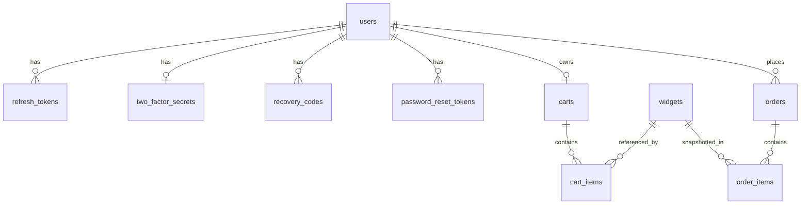

[← Handbook index](README.md) · [Project README](../../README.md)

# 6. Database & schema

## Why PostgreSQL (not SQLite)

SQLite is great for single-user, embedded scenarios, but this app relies on things a
server database does well:

- **Real concurrency & transactions** — checkout **reserves inventory** with a conditional
  `UPDATE … WHERE (on_hand - reserved) >= qty` inside a transaction, with reuse-detection
  on refresh tokens. That needs true multi-writer MVCC and row locking; SQLite is
  single-writer.
- **Rich types** — `uuid` keys, `numeric(12,2)` money (exact, not float), `timestamptz`
  for correct UTC instants, and `boolean`.
- **Expression & partial indexes** — `unique (upper(sku))`, `unique (user_id) where user_id
  is not null` (one cart per registered user, unlimited guest carts), `index (lower(email))`.
- **Procedural guards** — a **PL/pgSQL trigger** enforces the immutable admin at the data
  layer (defense in depth), which SQLite can’t express.
- **Array parameters** — `where order_id = any(@ids)` for efficient batched loads via Npgsql.
- **Production parity** — the dev database matches what you’d run in production, so behavior
  (types, constraints, concurrency) is the same everywhere.

Data access is **Dapper + Npgsql** — explicit SQL, no ORM. Snake_case columns map to
PascalCase properties automatically.

## Migrations

Schema is versioned as embedded `.sql` files run by **DbUp** on API startup, recorded in a
journal table so each runs once. Files live in
`src/WidgetWorks.Infrastructure/Migrations/`:

| # | Migration | Adds |
|---|---|---|
| 0001 | Users | `users` |
| 0002 | RefreshTokens | `refresh_tokens` |
| 0003 | AuditEvents | `audit_events` |
| 0004 | TwoFactor | `two_factor_secrets`, `recovery_codes` |
| 0005 | Widgets | `widgets` (+ check constraints, unique SKU) |
| 0006 | ProtectedAdminGuard | trigger protecting the seeded admin |
| 0007 | Carts | `carts`, `cart_items` |
| 0008 | Orders | `orders`, `order_items` |
| 0009 | OrderTracking | `orders.tracking_number` |
| 0010 | PasswordResetTokens | `password_reset_tokens` |
| 0011 | WidgetArchive | `widgets.archived_at` (+ partial index on the live set) |

## Schema overview

### Tables (key columns)

- **users** — `id`, `email`, `normalized_email`, `password_hash` (nullable for Google-only
  accounts), `role`, `security_stamp`, `is_protected_admin`, `two_factor_enabled`,
  `google_sub`, `failed_access_count`, `locked_until`, `created_at`.
- **refresh_tokens** — `id`, `user_id`, `token_hash` (SHA-256), `family_id`, `expires_at`,
  `revoked_at`, `created_at`. Rotation + reuse detection revoke a whole `family_id`.
- **two_factor_secrets** — `user_id`, `secret`, `is_confirmed`. **recovery_codes** —
  `id`, `user_id`, `code_hash`, `used_at` (single-use).
- **audit_events** — `id`, `user_id`, `action`, `detail`, `created_at` (login, lockout,
  2FA, password reset, etc.).
- **widgets** — `id`, `sku` (unique, upper), `name`, `description`, `image_url`, `price`
  `numeric(12,2)`, `is_active`, `quantity_on_hand`, `quantity_reserved`, `archived_at`,
  timestamps. Available = on_hand − reserved (enforced by a check constraint).
  `archived_at` marks a retired widget: `order_items` references `widgets(id)` with no delete
  rule, so a widget that has been sold cannot be removed without breaking order history. It is
  archived instead — the row stays for reporting, and every listing filters on
  `archived_at is null`. Widgets that were never ordered are deleted outright.
- **carts / cart_items** — cart is nullable-`user_id` (guest = null); items unique per
  `(cart_id, widget_id)`, FK-cascade.
- **orders** — `id`, `order_number` (unique), `user_id` (nullable = guest), `email`,
  `ship_*` address, `subtotal`, `shipping_method`, `shipping`, `tax_state`, `tax_rate`,
  `tax`, `total`, `status`, `payment_provider`, `payment_reference`, `tracking_number`,
  timestamps. **order_items** snapshot `sku`, `name`, `unit_price`, `quantity`,
  `line_subtotal` so history is stable even if a widget later changes.
- **password_reset_tokens** — `id`, `user_id`, `token_hash` (SHA-256), `expires_at`,
  `used_at` (single-use, 30-minute).
