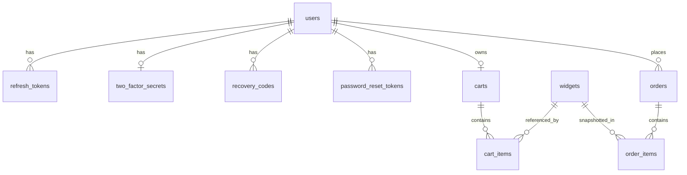

[← Handbook index](README.md) · [Project README](../../README.md)

# 6. Database & schema

## Why PostgreSQL (not SQLite or SQL Server)

### Why not SQLite

SQLite is great for single-user, embedded scenarios, but this app relies on things a
server database does well:

- **Real concurrency & transactions** — checkout **reserves inventory** with a conditional
  `UPDATE … WHERE (on_hand - reserved) >= qty` inside a transaction, with reuse-detection
  on refresh tokens. That needs true multi-writer MVCC and row locking; SQLite is
  single-writer.
- **Rich types** — `uuid` keys, `numeric(12,2)` money (exact, not float), `timestamptz`
  for correct UTC instants, and `boolean`.
- **Expression & partial indexes** — `unique (upper(sku))`, `unique (user_id) where user_id
  is not null` (one cart per registered user, unlimited guest carts), `index (lower(email))`.
- **Procedural guards** — a **PL/pgSQL trigger** enforces the protected demo accounts at the
  data layer (defense in depth), which SQLite can’t express. See
  [Protecting the demo](#protecting-the-demo).
- **Array parameters** — `where order_id = any(@ids)` for efficient batched loads via Npgsql.
- **Production parity** — the dev database matches what you’d run in production, so behavior
  (types, constraints, concurrency) is the same everywhere.

### Why not SQL Server

SQL Server was the other serious candidate, and it could have done the core job: transactions, row
locks, the conditional stock `UPDATE`, filtered unique indexes, triggers, and `uniqueidentifier` /
`decimal` / `datetimeoffset` types all exist there. The choice was about fit, not a missing feature:

- **Upserts are one statement.** The cart line and 2FA secret writes use
  `insert … on conflict (…) do update`. SQL Server needs `MERGE` (which needs `HOLDLOCK` to be safe
  under concurrency) or an update-then-insert pair.
- **Readers don't block writers by default.** Postgres reads use MVCC snapshots out of the box.
  Boxed SQL Server's default `READ COMMITTED` takes shared locks unless `READ_COMMITTED_SNAPSHOT` is
  switched on (Azure SQL Database turns it on for you), so stock checks and checkout could queue
  behind each other.
- **Less ceremony for the queries this app writes.** `upper(sku)` is indexed directly, where SQL
  Server needs a persisted computed column. `= any(@ids)` passes one array parameter with one cached
  plan; Dapper on SQL Server expands `in @ids` into one parameter per value (capped at 2,100) or needs
  a table-valued type. `update … returning` maps to SQL Server's `OUTPUT`, so that one is a wash.
- **A light dev container.** `postgres:16-alpine` (see `docker-compose.yml`) is small and starts in
  seconds; the SQL Server Linux image is over a gigabyte and needs at least 2 GB of RAM.
- **Free hosting that keeps the stack.** Azure has no free Postgres tier, but Neon's free plan runs
  the same Postgres. Azure SQL's free offer is real, but switching to it would mean porting every
  migration and repository — see [deploying on free tiers](10-deploy-azure-free.md).

SQL Server would have been a defensible choice; Postgres made the concurrency-sensitive paths simpler
to write and cost nothing to host.

Data access is **Dapper + Npgsql** — explicit SQL, no ORM. Snake_case columns map to
PascalCase properties automatically.

## Migrations

Schema is versioned as embedded `.sql` files run by **DbUp** on API startup, recorded in a
journal table so each runs once. Files live in
`src/WidgetWorks.Infrastructure/Migrations/`:

| # | Migration | Adds |
|---|---|---|
| 0001 | Users | `users` |
| 0002 | RefreshTokens | `refresh_tokens` |
| 0003 | AuditEvents | `audit_events` |
| 0004 | TwoFactor | `two_factor_secrets`, `recovery_codes` |
| 0005 | Widgets | `widgets` (+ check constraints, unique SKU) |
| 0006 | ProtectedAdminGuard | trigger protecting the seeded admin |
| 0007 | Carts | `carts`, `cart_items` |
| 0008 | Orders | `orders`, `order_items` |
| 0009 | OrderTracking | `orders.tracking_number` |
| 0010 | PasswordResetTokens | `password_reset_tokens` |
| 0011 | WidgetArchive | `widgets.archived_at` (+ partial index on the live set) |
| 0012 | RealignDemoCatalog | data only — realigns seeded demo widgets' names, descriptions and prices |
| 0013 | IdempotencyKeys | `idempotency_keys` (composite PK `(scope, key)`, index on `created_at`) |
| 0014 | PaymentReconciliation | `orders.payment_unconfirmed_at` (+ partial index on the unresolved set) |
| 0015 | RefundTotals | `orders.refunded_total` (+ check constraint keeping it within the order) |
| 0016 | DemoProtection | `orders.is_protected` (+ partial index); extends the protected-account trigger to block enabling 2FA |

## Schema overview

```mermaid
erDiagram
  users ||--o{ refresh_tokens : has
  users ||--o| two_factor_secrets : has
  users ||--o{ recovery_codes : has
  users ||--o{ password_reset_tokens : has
  users ||--o| carts : owns
  carts ||--o{ cart_items : contains
  widgets ||--o{ cart_items : referenced_by
  users ||--o{ orders : places
  orders ||--o{ order_items : contains
  widgets ||--o{ order_items : snapshotted_in
```

### Tables (key columns)

- **users** — `id`, `email`, `normalized_email`, `password_hash` (nullable for Google-only
  accounts), `role`, `security_stamp`, `is_protected_admin`, `two_factor_enabled`,
  `google_sub`, `failed_access_count`, `locked_until`, `created_at`.
- **refresh_tokens** — `id`, `user_id`, `token_hash` (SHA-256), `family_id`, `expires_at`,
  `revoked_at`, `created_at`. Rotation + reuse detection revoke a whole `family_id`.
- **two_factor_secrets** — `user_id`, `secret`, `is_confirmed`. **recovery_codes** —
  `id`, `user_id`, `code_hash`, `used_at` (single-use).
- **audit_events** — `id`, `user_id`, `action`, `detail`, `created_at` (login, lockout,
  2FA, password reset, refunds, order status changes, reconciliation outcomes). A null `user_id`
  marks a system action, such as reconciliation settling a charge nobody pressed a button for.
- **widgets** — `id`, `sku` (unique, upper), `name`, `description`, `image_url`, `price`
  `numeric(12,2)`, `is_active`, `quantity_on_hand`, `quantity_reserved`, `archived_at`,
  timestamps. Available = on_hand − reserved; `ck_widgets_reserved_range` keeps
  0 ≤ reserved ≤ on_hand, so it can never go negative.
  `archived_at` marks a retired widget: `order_items` references `widgets(id)` with no delete
  rule, so a widget that has been sold cannot be removed without breaking order history. It is
  archived instead — the row stays for reporting, and every listing filters on
  `archived_at is null`. Widgets that were never ordered are deleted outright.
- **carts / cart_items** — cart is nullable-`user_id` (guest = null); items unique per
  `(cart_id, widget_id)`, FK-cascade.
- **orders** — `id`, `order_number` (unique), `user_id` (nullable = guest), `email`,
  `ship_*` address, `subtotal`, `shipping_method`, `shipping`, `tax_state`, `tax_rate`,
  `tax`, `total`, `status`, `payment_provider`, `payment_reference`, `tracking_number`,
  `payment_unconfirmed_at`, timestamps. `status` includes **Refunded**, reached only through the
  refund use case. `refunded_total` is cumulative and constrained to `0 <= refunded_total <= total`,
  because the compare-and-set that stops two staff refunding at once relies on comparing against it. `payment_unconfirmed_at` marks an order whose charge outcome
  the provider never gave: it holds its stock reservation and is **excluded from the stale-reservation
  sweep**, because failing a charge that may have succeeded is worse than holding the stock. Settling
  the order — by webhook or by reconciliation — clears it. See
  [Payments](05-payments.md#reconciliation). **order_items** snapshot `sku`, `name`, `unit_price`, `quantity`,
  `line_subtotal` so history is stable even if a widget later changes.
- **password_reset_tokens** — `id`, `user_id`, `token_hash` (SHA-256), `expires_at`,
  `used_at` (single-use, 30-minute).
- **idempotency_keys** — `scope`, `key` (composite **primary key**), `request_hash`,
  `status`, `response_body`, `response_error`, `created_at`, `completed_at`. The retry ledger
  behind `POST /checkout`. Deliberately **not** related to `orders` or `carts`: a row is written
  before the order exists, and must outlive the cart that checkout deletes on success, so a
  retry arriving afterwards can still be answered. The primary key *is* the concurrency
  control — a claim is one `insert … on conflict do nothing`, so simultaneous arrivals get
  exactly one winner without a lock. `request_hash` is a SHA-256 of the command, not a copy
  of it: the ledger has no business holding a second copy of anyone's address. Rows are
  deleted after `Idempotency:RetentionHours` by the background sweep, which is what the
  `created_at` index is for. See [Payments](05-payments.md#retry-safety-on-checkout).

## Protecting the demo

The demo publishes its credentials, so every visitor arrives with Administrator rights. Most of what
they can then do heals on the next restart — the seeder re-inserts missing accounts and re-seeds the
catalogue. Three things did not heal, and these are the guards for them.

**All three demo accounts are protected**, not just the administrator (`is_protected_admin`). The
trigger from `0006` makes a protected row's email, role and **password hash** immutable and the row
itself undeletable. The manager and customer had none of that before, which mattered most for the
password: the seeder is insert-if-absent, so it deliberately never overwrites one — a changed demo
password would have needed fixing by hand.

**Enabling 2FA on a protected account is refused**, at the handler and again in the trigger. It is the
only action a visitor can take that nothing recovers from: signing in afterwards needs a code only the
enroller holds, the recovery codes were shown only to them, and turning it off needs a session nobody
can obtain. Turning 2FA *off* stays allowed, so this cannot wedge an account the other way, and
stamp rotation, lockout counters and `google_sub` linking are untouched — they cost nothing permanent.

**`orders.is_protected` marks the showcase orders**, and refunding or cancelling one is refused.
Nothing re-seeds orders, so either action would remove an exhibit for good. The flag is set by the
seeder on every boot, by **owner** rather than by anything the seeder wrote — these orders were placed
through the app, so they are found by belonging to a demo account. Running every boot is what
retro-fits the flag onto a database that already holds them.

Shipping and delivering a protected order stays allowed: fulfilment is a headline feature, and
refusing every transition would mean nobody could try it on the orders already there.

### What is deliberately not guarded

- **Catalogue widgets can still be deleted.** `SeedWidgetsAsync` recreates them on the next restart,
  so the damage is temporary.
- **The demo administrator can still be locked out** by five deliberate wrong passwords. It heals
  after the lockout window.

Both are recoverable, which is why they are noted here rather than fixed. The general answer to
everything in this section — including whatever has not been thought of — is a scheduled re-seed to a
known baseline.
